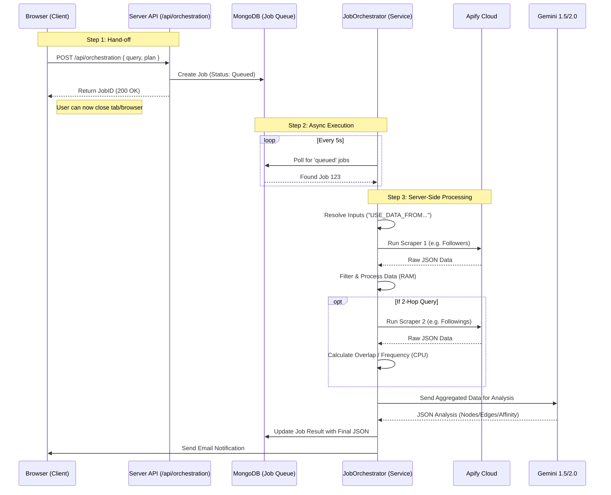

# Fandom Mapper: Technical Architecture

## 1. System Overview

Fandom Mapper is a **multi-agent social intelligence platform** that visualizes the "dark matter" of social influence. It moves beyond simple follower counts to map *why* communities connect, using a combination of graph theory, multimodal AI, and high-performance 3D visualization.

### High-Level Architecture
```mermaid
graph TD
    User[User Client (React 19)] <-->|REST API| Server[Node.js Express Server]
    Server <-->|Orchestration| Gemini[Gemini 3 Flash (Planner)]
    Server <-->|Scraping| Apify[Apify Platform]
    Server <-->|Persistence| Mongo[(MongoDB Atlas)]
    
    subgraph "Core Engines"
    Gemini -->|1. Plan| Orchestrator[Job Orchestrator]
    Orchestrator -->|2. Execute| ScraperService
    ScraperService -->|3. Ingest| DataPipeline
    DataPipeline -->|4. Analyze| VisualDNA[Gemini 3 Pro (Multimodal)]
    end
```

---

## 2. Core Components

### Frontend (`/client`)
*   **Framework**: React 19 (Latest features: Actions, useOptimistic)
*   **Visualization**: `react-force-graph-3d` (Three.js wrapper)
    *   Custom shaders for node glowing and link particles.
    *   Instanced mesh rendering for performance (supports 5,000+ nodes).
*   **State Management**: React Context + SWR for data fetching.
*   **Styling**: TailwindCSS with a custom "Glassmorphism" theme.

### Backend (`/server`)
*   **Runtime**: Node.js (TypeScript)
*   **API**: Express.js REST API
*   **Orchestrator**: A custom-built, stateful engine that manages long-running jobs.
    *   **Self-Healing**: Automatically retries failed scrapes and rotates API tokens.
    *   **Dynamic Planning**: Uses Gemini 3 Flash to generate execution plans based on user queries (e.g., "Find skaters in London" -> triggers location-based scraping).

### Database (`MongoDB`)
*   **Collections**:
    *   `jobs`: Tracks the state of every analysis request.
    *   `datasets`: Stores raw scraped chunks (fingerprinted for deduplication).
    *   `snapshots`: Stores the final, processed graph structure for the frontend.

### AI Intelligence Layer
*   **Planner**: **Gemini 3 Flash**. Fast, logical. Decides *which* scrapers to run and *how many* profiles to fetch.
*   **Analyst**: **Gemini 3 Pro**. Analyzing bios, captions, and visual aesthetics.
*   **Visual DNA**: **Gemini 3 Pro (Multimodal)**. Processes profile pictures and top posts to extract "Vibes" (e.g., "Cottagecore", "Cyberpunk").

---

## 3. Key Workflows

### The "Plan-Execute-Enrich" Loop
1.  **Intent Analysis**: User query is sent to Gemini 3 Flash.
    *   *Input*: "Map the fandom of @archdigest"
    *   *Output*: JSON Plan `{ intent: "community_map", steps: [...] }`
2.  **Execution**: The Orchestrator runs the steps via Apify.
    *   *Step 1*: Scrape followers (Actors: `instagram-followers-scraper`)
    *   *Step 2*: Scrape detailed profiles (Actors: `instagram-profile-scraper`)
3.  **Synthesis**: Raw data is fed back into Gemini 3 Pro to identify "Tribes" (Clusters) and "Cultural Leaders".
4.  **Visualization**: Final graph is pushed to the client.

### Visual DNA Engine
1.  **Sampling**: System selects the top 10 most influential nodes in a cluster.
2.  **Vision Analysis**: Gemini 3 Pro analyzes their profile images + last 3 posts.
3.  **Tagging**: Generates aesthetic tags (e.g., "Minimalist", "Industrial", "Retro").
4.  **Color Extraction**: Extracts the dominant color palette for the 3D UI.

---

## 4. Data Models (Simplified)

### `Job`
```typescript
interface Job {
  id: string;
  userId: string;
  type: 'map_generation' | 'profile_analysis';
  status: 'queued' | 'processing' | 'completed' | 'failed';
  data: {
    query: string;
    sampleSize: number;
  };
  result?: {
    graphSnapshotId: string;
    metrics: AccuracyMetrics;
  };
}
```

### `GraphNode`
```typescript
interface GraphNode {
  id: string; // Unique identifier (usually username or tag)
  label: string; // Display name
  group: 'creator' | 'brand' | 'hashtag' | 'location';
  val: number; // Size (based on follower count or influence)
  data: {
    profileUrl?: string;
    imgUrl?: string; // Proxied URL
    followersCount?: number;
    visualTags?: string[]; // AI-generated tags
    overindexScore?: number; // "Cult Score"
  };
}
```

---

## 5. Security & Scaling

*   **Token Rotation**: Apify tokens are rotated automatically on 403 errors.
*   **Result Caching**: Scrape results are fingerprinted (SHA-256 of inputs) and cached in MongoDB for 24 hours to save costs.
*   **Cost Auditing**: Before running, the system estimates the "Credit Cost" based on `sampleSize` and prevents users from exceeding their balance.
*   **Rate Limiting**: Express middleware limits API requests per IP.

---

## 6. Intent Workflows & Tree Construction

The system uses Gemini 3 Flash to dynamically route user queries into specific "Intent Workflows". Each intent has a tailored scraping strategy.

### Standard Intent Strategies

| Intent | Description | Strategy (Simplified) |
| :--- | :--- | :--- |
| **Over Indexing / Brand Affinity** | Find niche brands/accounts a community follows. | 1. Scrape Followers of X.<br>2. Scrape Followings of those Followers.<br>3. Enrich the most common accounts. |
| **Comparison / Audience Overlap** | Compare two communities/brands. | 1. Parallel scrape of Followers for Entity A & B.<br>2. Enrich both sets.<br>3. Calculate overlap/intersection. |
| **Influencer Identification** | Find creators in a specific niche/location. | 1. Google/Instagram Search for keywords.<br>2. Enrich resulting profiles to verify stats. |
| **Geo Discovery** | Map where an audience is located. | 1. Scrape Followers of X.<br>2. Enrich to extract city/country data. |
| **Subject Matter / Viral Content** | Analyze what valid topics a community discusses. | 1. Scrape Followers of X.<br>2. Scrape Recent Posts of a subset.<br>3. Analyze captions/hashtags. |
| **Complex Search** | Multi-criteria lookup (e.g., "Parisian nano-influencers who like Nike"). | 1. Complex Google Search queries.<br>2. Enrich profiles to filter by bio/follower count. |

### Tree Construction Algorithm

The transformation from "Raw Scraped Data" to the final "3D Node Tree" involves a 4-step pipeline:

```mermaid
graph TD
    A[User Query] -->|Gemini 3 Flash| B[Scrape Plan]
    B -->|Apify Actors| C[Raw JSON Data]
    C -->|Gemini 3 Pro + Algorithms| D[Ideal Graph Structure]
    D -->|Hydration Engine| E[Final Enriched Tree]
    
    subgraph "Step 3: Intelligence Layer"
    D1[Raw Profiles/Posts] --> D2[Cluster Analysis]
    D2 --> D3[Identify Tribes/Topics]
    D3 --> D4[Generate 'Ideal' Nodes]
    end

    subgraph "Step 4: Hydration & Remediation"
    E1[Ideal Node (e.g. 'Gorpcore Aesthetic')] --> E2{Match Found in Scrape?}
    E2 -- Yes --> E3[Hydrate with Real Stats]
    E2 -- No --> E4[Gap Remediation Scrape]
    E4 --> E3
    end
```

1.  **Plan Generation**: The Orchestrator analyzes the query intent and generates a multi-step execution plan (e.g., "Scrape followers, then scrape their recent posts").
2.  **Data Acquisition**: Apify actors execute the plan, returning raw user/post objects.
3.  **Intelligence Layer**:
    *   **Clustering**: Gemini 3 Pro analyzes the raw data (bios, captions, hashtags) to identify emergent "Clusters" (e.g., "Cozy Gamers", "Sustainable Fashion").
    *   **Topic Extraction**: Detailed topic hierarchy is built from content analysis.
4.  **Enrichment & Hydration**:
    *   The "Ideal Graph" (concepts/clusters) is mapped back to real user profiles (`profileMap`).
    *   **Gap Remediation**: If the AI identifies a key node (e.g., a specific influencer) that wasn't fully scraped, a targeted "Verification Scrape" is triggered to fetch their real data, ensuring no "ghost nodes" exist in the final graph.


# Server-Side Query Process & Data Flow

## 1. Architecture Overview (100% Server-Side)

The system uses an **Asynchronous Job Queue** pattern. This ensures that once a user clicks "Execute", the entire process happens on the server (Node.js/Mongo). The user can close their browser without interrupting the job.



## 2. Intent-Specific Processing Pipelines

The `JobOrchestrator` applies different **Post-Processing Logic** depending on the specific intent of the query.

### A. Intent: `map_followers` (Simple Mapping)
*   **Goal**: Visualize the audience of a specific account.
*   **Workflow**:
    1.  **Scrape**: Fetch 100-500 followers of `@target` using `instagram-followers-followings-scraper`.
    2.  **Filter**: Remove private accounts or those without profile pics (optional).
    3.  **Enrichment**: (If cost check passes) Fetch full bio/posts for top 50 users via `instagram-api-scraper`.
    4.  **No Complex Math**: Data is passed directly to AI for categorization ("Group these people by bio interests").

### B. Intent: `over_indexing` (Affinity Analysis)
*   **Goal**: Find what *else* an audience follows (e.g., "What do Nike followers like?").
*   **Workflow**:
    1.  **Hop 1**: Scrape Followers of `@target` -> Result A (e.g., 500 users).
    2.  **Hop 2**: Scrape **Followings** of everyone in Result A -> Result B (e.g., 10,000+ rows).
    3.  **Calculation (Server-Side CPU)**:
        *   **Frequency Counting**: The server iterates through all 10k rows in Result B.
        *   **Weighting**: Calculates how many unique people from Source A follow the same account in Result B.
        *   **Filter**: Discards accounts with `< 2` overlaps (noise).
        *   **Sort**: Ranks by `_frequency` desc.
        *   **Truncate**: Keeps top 200 signals.
    4.  **Output**: A weighted list (e.g., "@espn: 45 hits", "@adidas: 30 hits") sent to AI.

### C. Intent: `comparison` (Overlap / Common Audiences)
*   **Goal**: Find the intersection of two audiences (e.g., "Overlap between @nike and @adidas").
*   **Workflow**:
    1.  **Step 1**: Scrape Followers of `@nike` -> List A (500 users).
    2.  **Step 2**: Scrape Followers of `@adidas` -> List B (500 users).
    3.  **Logic (Input Resolution)**:
        *   The Orchestrator detects `["USE_DATA_FROM_STEP_1", "USE_DATA_FROM_STEP_2"]`.
        *   It merges List A and List B into a single pool for the next step (Intersector).
    4.  **Calculation**:
        *   **Intersection**: Finds users present in *both* arrays`A ∩ B`.
        *   **Venn Diagram**: Labels users as "Only A", "Only B", or "Both".

### D. Intent: `bio_search` (Keyword Filtering)
*   **Goal**: Find specific people in an audience (e.g., "Find photographers following @canon").
*   **Workflow**:
    1.  **Scrape**: Fetch followers.
    2.  **Enrichment**: **Mandatory** fetch of full bios using `instagram-api-scraper`.
    3.  **Processing**:
        *   **Strict Filtering**: Server regex-matches keywords (e.g., "photographer", "camera", "lens") against the `biography` field.
        *   **Ranking**: Assigns a `score` (5.0 = Exact keyword match in name, 3.0 = Match in bio).

## 3. Data Calculations (Server-Side Formulas)

All calculations happen in `server/services/jobOrchestrator.ts` using Node.js memory.

### Frequency Algorithm (`aggregateOverindexingLocal`)
Used to determine "Rising Popularity":
```typescript
forEach(signal in raw_followings) {
  frequencyMap[signal.username]++
}
sorted = sort(frequencyMap, (a,b) => b.count - a.count)
return sorted.slice(0, 200)
```

### Affinity Score (AI + Server)
*   **Raw Overlap**: Number of source users following a target.
*   **Affinity %**: `(Raw Overlap / Sample Size) * 100`.
*   *Note*: The UI displays this as "24% of Nike followers also follow Adidas".

### Cost Calculation (`costCalculator.ts`)
Calculated *before* execution to verify user balance.
*   **Formula**: `(Apify Cost + Gemini Cost + Proxy Cost) * Margin`.
*   **Rate**: `$5.38 USD` per 1k profiles for API Scraper -> Converted to `~£4.30 GBP`.
