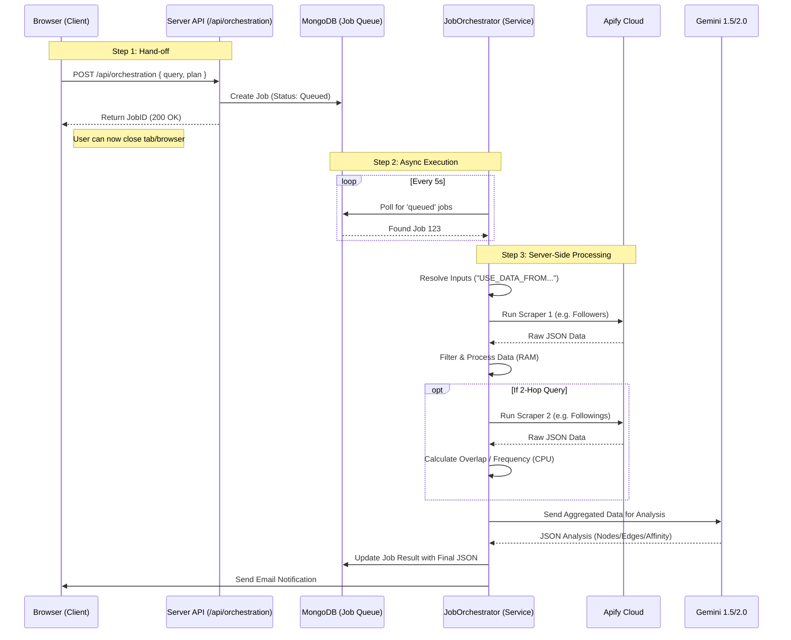

# Server-Side Query Process & Data Flow

## 1. Architecture Overview (100% Server-Side)

The system uses an **Asynchronous Job Queue** pattern. This ensures that once a user clicks "Execute", the entire process happens on the server (Node.js/Mongo). The user can close their browser without interrupting the job.



## 2. Intent-Specific Processing Pipelines

The `JobOrchestrator` applies different **Post-Processing Logic** depending on the specific intent of the query.

### A. Intent: `map_followers` (Simple Mapping)
*   **Goal**: Visualize the audience of a specific account.
*   **Workflow**:
    1.  **Scrape**: Fetch 100-500 followers of `@target` using `instagram-followers-followings-scraper`.
    2.  **Filter**: Remove private accounts or those without profile pics (optional).
    3.  **Enrichment**: (If cost check passes) Fetch full bio/posts for top 50 users via `instagram-api-scraper`.
    4.  **No Complex Math**: Data is passed directly to AI for categorization ("Group these people by bio interests").

### B. Intent: `over_indexing` (Affinity Analysis)
*   **Goal**: Find what *else* an audience follows (e.g., "What do Nike followers like?").
*   **Workflow**:
    1.  **Hop 1**: Scrape Followers of `@target` -> Result A (e.g., 500 users).
    2.  **Hop 2**: Scrape **Followings** of everyone in Result A -> Result B (e.g., 10,000+ rows).
    3.  **Calculation (Server-Side CPU)**:
        *   **Frequency Counting**: The server iterates through all 10k rows in Result B.
        *   **Weighting**: Calculates how many unique people from Source A follow the same account in Result B.
        *   **Filter**: Discards accounts with `< 2` overlaps (noise).
        *   **Sort**: Ranks by `_frequency` desc.
        *   **Truncate**: Keeps top 200 signals.
    4.  **Output**: A weighted list (e.g., "@espn: 45 hits", "@adidas: 30 hits") sent to AI.

### C. Intent: `comparison` (Overlap / Common Audiences)
*   **Goal**: Find the intersection of two audiences (e.g., "Overlap between @nike and @adidas").
*   **Workflow**:
    1.  **Step 1**: Scrape Followers of `@nike` -> List A (500 users).
    2.  **Step 2**: Scrape Followers of `@adidas` -> List B (500 users).
    3.  **Logic (Input Resolution)**:
        *   The Orchestrator detects `["USE_DATA_FROM_STEP_1", "USE_DATA_FROM_STEP_2"]`.
        *   It merges List A and List B into a single pool for the next step (Intersector).
    4.  **Calculation**:
        *   **Intersection**: Finds users present in *both* arrays`A ∩ B`.
        *   **Venn Diagram**: Labels users as "Only A", "Only B", or "Both".

### D. Intent: `bio_search` (Keyword Filtering)
*   **Goal**: Find specific people in an audience (e.g., "Find photographers following @canon").
*   **Workflow**:
    1.  **Scrape**: Fetch followers.
    2.  **Enrichment**: **Mandatory** fetch of full bios using `instagram-api-scraper`.
    3.  **Processing**:
        *   **Strict Filtering**: Server regex-matches keywords (e.g., "photographer", "camera", "lens") against the `biography` field.
        *   **Ranking**: Assigns a `score` (5.0 = Exact keyword match in name, 3.0 = Match in bio).

## 3. Data Calculations (Server-Side Formulas)

All calculations happen in `server/services/jobOrchestrator.ts` using Node.js memory.

### Frequency Algorithm (`aggregateOverindexingLocal`)
Used to determine "Rising Popularity":
```typescript
forEach(signal in raw_followings) {
  frequencyMap[signal.username]++
}
sorted = sort(frequencyMap, (a,b) => b.count - a.count)
return sorted.slice(0, 200)
```

### Affinity Score (AI + Server)
*   **Raw Overlap**: Number of source users following a target.
*   **Affinity %**: `(Raw Overlap / Sample Size) * 100`.
*   *Note*: The UI displays this as "24% of Nike followers also follow Adidas".

### Cost Calculation (`costCalculator.ts`)
Calculated *before* execution to verify user balance.
*   **Formula**: `(Apify Cost + Gemini Cost + Proxy Cost) * Margin`.
*   **Rate**: `$5.38 USD` per 1k profiles for API Scraper -> Converted to `~£4.30 GBP`.
